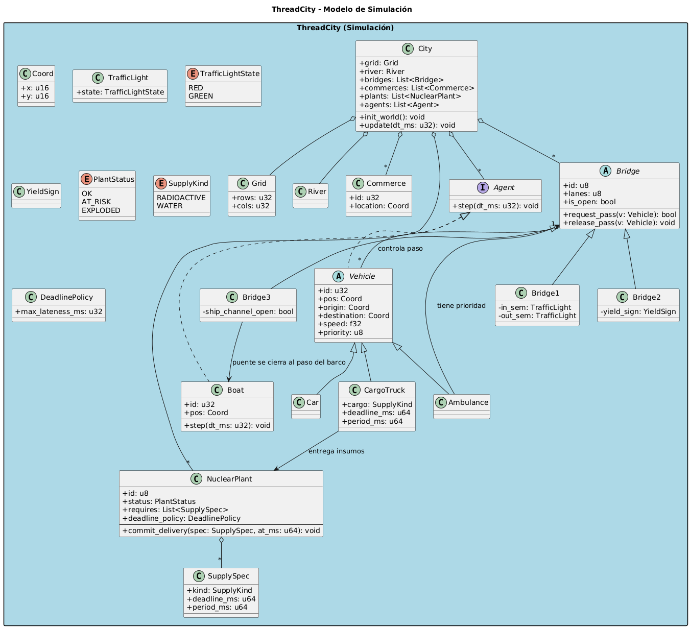

# Kickoff

## Introducción

En el siguiente proyecto se estará trabajando en el lenguaje **Rust**, haciendo una **reimplementación de la biblioteca pthreads**, llamada **mypthreads**, donde se implementarán las siguientes funciones y métodos:

`my_thread_create`, `my_thread_end`, `my_thread_yield`, `my_thread_join`, `my_thread_detach`, `my_mutex_init`, `my_mutex_destroy`, `my_mutex_lock`, `my_mutex_unlock`, `my_mutex_trylock` y `my_thread_chsched`.

La biblioteca soportará **tres opciones de scheduler**: **RoundRobin**, **Sorteo** y **Tiempo Real**.  
Estas herramientas se utilizarán para la creación de una **simulación de una ciudad “ThreadCity”**, usando la biblioteca **GTK**, que cuenta con los siguientes elementos que interactúan de formas distintas entre ellos, en muchas ocasiones con **orden de prioridad** (algunas siendo gestionadas por hilos con diferentes tipos de scheduling):

- Carros  
- Ambulancias  
- Barcos  
- Puentes  
- Comercios  
- Plantas nucleares

---

## Estrategia

- Investigar sobre la biblioteca pthreads, sus componentes y funcionamiento para su implementación.  
- Implementar lo aprendido en nuestra biblioteca **mypthreads**.  
- Implementar y probar **cada scheduler** de forma independiente.  
- **Simular** la ciudad como base con sus elementos estáticos (bloques, comercios, plantas nucleares, río, puentes).  
- Ir implementando consecutivamente cada uno de los **elementos dinámicos** para que primero interactúen con sus alrededores.  
- Manejar los **casos de concurrencia** e interacciones entre los elementos dinámicos (comprobaciones y **prioridades**).  
- Crear la **documentación**.

---

## Ambiente de desarrollo

- **Lenguaje de programación:** Rust  
- **IDE:** RustRover  
- **Sistema Operativo:** Linux  
- **GitHub:** Para contar con un respaldo en la nube  
- **Biblioteca GTK:** Para la animación de la simulación de la ciudad

---

## Control de Versiones

Para el control de versiones se hizo un repositorio de GitHub que se puede ver en el siguiente enlace:  
<https://github.com/KiwilEstafas/Proyecto1_SO.git>

---

## Diagrama UML

<!-- Espacio para la imagen del diagrama -->

---

## Núcleo del mundo

**City (C)**: orquesta la simulación. Tiene:

- **Grid (C):** tamaño de la ciudad (`rows`, `cols`).  
- **River (C):** representa el río central que divide la ciudad (norte/sur) y bajo/entre puentes.  
- **Coord (C):** coordenadas x/y para posiciones.

**Métodos:**

- `init_world()` crea el mapa y registra a todos los agentes.  
- `update(dt_ms)` itera a través de todos los agentes y les llama `step(dt_ms)`.

---

## Economía / estáticos

**Commerce (C):** comercios dentro de las cuadras, tienen `id` y `location`; los vehículos pueden tenerlos como destinos.

---

## Señalización y puentes

**Bridge (A):** clase base de los puentes.

- **Atributos:** `id`, `lanes`, `is_open`  
- **Operaciones:**  
  - `request_pass(v: Vehicle) -> bool` (pide paso)  
  - `release_pass(v: Vehicle)` (libera paso)

**Tipos de puentes:**

- **Bridge1 (C):** 1 carril + **dos semáforos** (entrada/salida).  
- **Bridge2 (C):** 1 carril + **“ceda el paso”** en un extremo.  
- **Bridge3 (C):** 2 carriles pero **se inhabilita cuando pasa un barco** (abre el canal).

---

## Agentes móviles

**Agent (I):** interfaz con `step(dt_ms)`. Cualquier actor **activo** de la simulación la implementa.

**Vehicle (A):** base para vehículos terrestres.

- **Car (C):** vehículo normal.  
- **Ambulance (C):** vehículo con **prioridad en puentes** (la lógica de `request_pass` de un puente debe respetar su prioridad).  
- **Boat (C + I):** barco que navega en el río, **implementa Agent** (`step`). Interactúa con el **Bridge3** (al pasar, el puente se cierra al tráfico).

---

## Planta nuclear y logística de suministros

**SupplyKind (Enum):**  
Lista de los **tipos de carga** que la planta necesita:

- `RADIOACTIVE`: material radioactivo.  
- `WATER`: agua para enfriar el reactor.

**SupplySpec (Clase):** define **qué** recurso se necesita y **cada cuánto**:  
- `kind`: el tipo (radioactivo o agua).  
- `deadline_ms`: tiempo límite máximo entre entregas.  
- `period_ms`: frecuencia ideal de entrega.

**DeadlinePolicy (Clase):** define la **tolerancia al atraso** (`max_lateness_ms`).

**PlantStatus (Enum):** estado de la planta:
- `OK`, `AT_RISK`, `EXPLODED`.

**NuclearPlant (Clase principal):** representa la planta.  
Guarda:
- `status`  
- `requires: List<SupplySpec>`  
- `deadline_policy`

**Método:**  
- `commit_delivery(spec, at_ms)`: se llama cuando llega un camión; revisa qué trajo y **si llegó a tiempo**. Si llega tarde demasiadas veces, la planta cambia de estado (`OK → AT_RISK → EXPLODED`).

**CargoTruck (Clase):** camión que transporta los suministros.  
- `cargo`: `SupplyKind` (agua o material radioactivo)  
- `period_ms`: cada cuánto debe entregar  
- `deadline_ms`: límite máximo de llegada